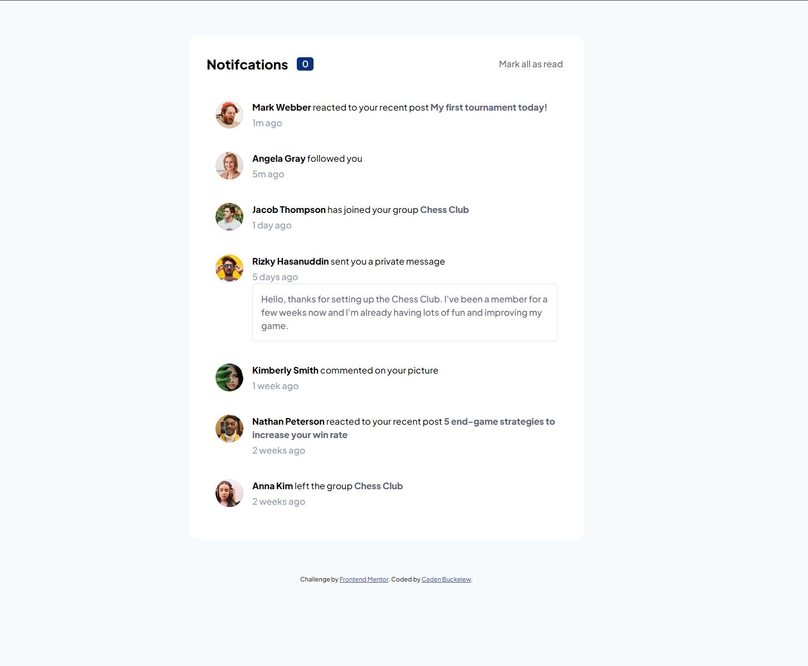

### Links

- Live Site URL: [https://buckelew.github.io/frontendmentor-notifications-page/](https://buckelew.github.io/frontendmentor-notifications-page/)

## My process

- Define html structure
- Style using css (flexbox)
- Make sure design is responsive, working in desktop and mobile.
- Use JavaScript to mark notifications as read.

### Built with

- Semantic HTML5 markup
- CSS custom properties
- Vanilla JavaScript

### What I learned

Furthered my rem skills, and sharpened up on some vanilla javascript.
Used 100 - 900 naming syntax for css variables.

### I plan to:

- continue to use the same css variable naming syntax, and do some more in depth vanilla JavaScript.

### Useful resources

- [CSS YT](https://www.youtube.com/kepowob) - This guy is the best <3

## Author

- Website - [Caden Buckelew](https://cadenbuckelew.com)
- Frontend Mentor - [@Buckelew](https://www.frontendmentor.io/profile/Buckelew)
